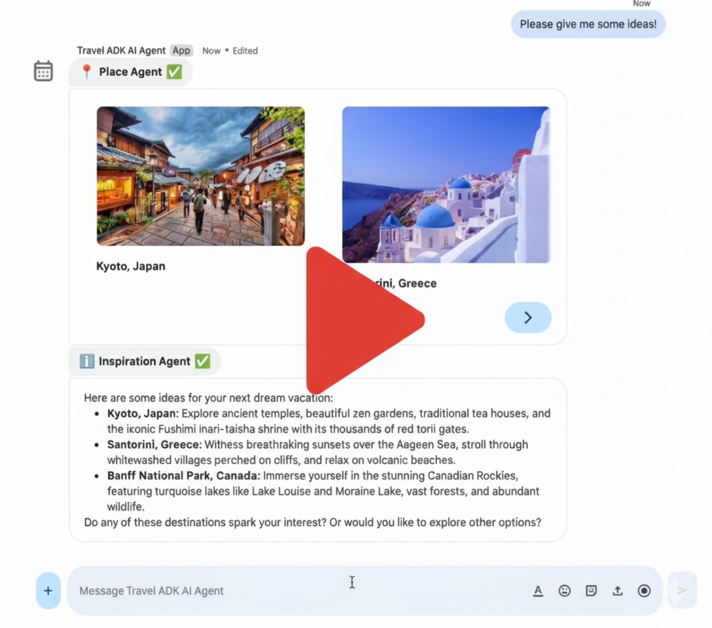
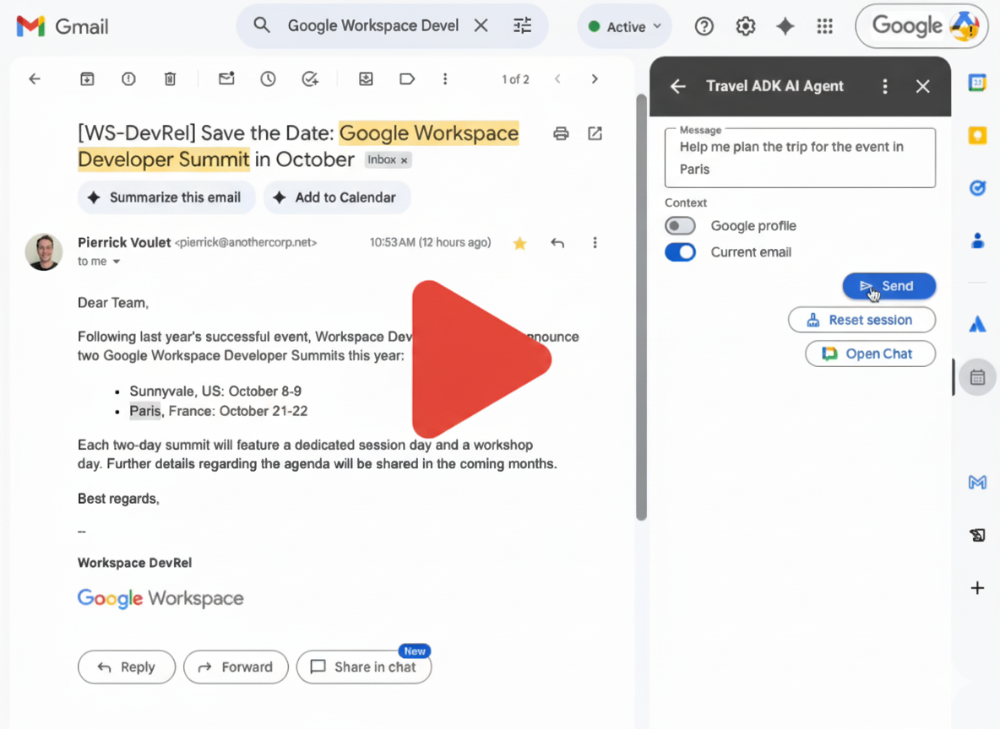
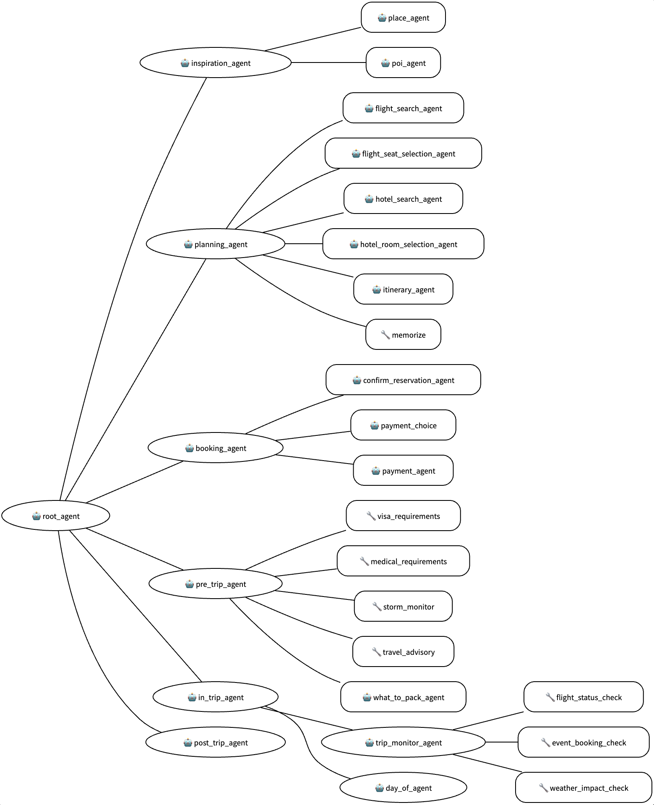

# Travel Concierge ADK AI multi-agent published as Google Workspace add-on

This project integrates the Travel Concierge—an advanced, multi-agent AI from the Agent Development Kit (ADK) samples—into Google Workspace.

## Showcase

### Chat

### Gmail, Calendar, Drive

## Overview

While the ADK provides default interfaces for developers (chat and text), this project focuses on creating a Graphical User Interface (GUI) dedicated to end-users. It demonstrates how to publish the Travel Concierge as a single Google Workspace add-on, making it accessible directly within applications like Google Chat, Gmail, Calendar, and Drive.

This solution serves as a practical guide and a reusable framework for developers who want to connect powerful, custom AI agents to Google Workspace, allowing users to leverage advanced AI capabilities seamlessly within their existing workflows.

## Agent

The [Travel Concierge ADK AI multi-agent being used](https://github.com/google/adk-samples/tree/main/python/agents/travel-concierge) is a conversational agent sample developed with the ADK. It's an advanced example, really close to a real-life AI agent. It uses tools like the Google Places API, Google Search Grounding, and a Model Context Protocol (MCP) server.

To expose this agent to end-users, a GUI with specific features is necessary as discussed [here](https://github.com/google/adk-samples/blob/main/python/agents/travel-concierge/README.md#gui). This sample shows how to build such a GUI by extending Google Workspace.

## Architecture

This solution relies on the following technologies: Google Chat API, People API, Gmail API, Vertex AI Agent Engine API, and Apps Script.

## Features

* **User Sessions:** Sessions are managed in Vertex AI. Each user shares one session across all Workspace apps. Users can manually reset their session to start a new conversation.
* **Rich Messaging:** Users send text messages and receive responses with rich text and graphical card elements (carousels, images, buttons, links).
* **Error Handling:** Features configurable retries and informs users of unexpected failures with graceful interactions.
* **Gmail Context:** Users can include the current email's subject and body in their message to the agent.
* **Chat Attachments:** Users can send messages with recorded audio or file attachments for extra context.
* **User Context:** The agent can optionally include user profile data, such as birthdays (available in Gmail, Calendar, Drive).
* **Switch to Chat:** Access the Chat app DM in a single click from other apps (Gmail, Calendar, Drive) to access Chat-only features.
* **Agent Responsivity:** Agent interactions are displayed after completion because Apps Script cannot make asynchronous requests.

## Limitations

Agent interactions can timeout when too long and cannot be processed in real time due to Apps Script `UrlFetchApp`. Check the [Python version of this code sample](../../python/travel-adk-ai-agent/) to learn how you can overcome these limitations by relying on HTTP endpoints instead of Apps Script.

## Prerequisites

* Google Cloud Project with billing enabled.

## Set up

1. Configure the Google Cloud project
   1. Enable the Vertex AI, Chat, Places, and People APIs.
   1. Create a Service Account and grant the role `Vertex AI User`.
   1. Create a private key with type JSON. This will download the JSON file.
1. Setup, install, and deploy the Travel Concierge ADK AI Agent sample
   1. Use Vertex AI
   1. Use the same Google Cloud project
   1. Use the location `us-central1`
   1. Use the Vertex AI Agent Engine
1. Set up Standalone Apps Script
   1. Create the project with the sources from this project
   1. Link it to your Google Cloud project
   1. Configure the script properties
1. Publish Google Workspace add-on
   1. Configure Google Chat API to use the Apps Script project with Head Deployment ID
   1. Install in Gmail, Calendar, and Drive from test deployment

## Customization

The core logic supports any ADK AI agent hosted in Vertex AI Agent Engine. Key customization points are:

* `Code.gs`: Defines the main UI layouts and user interaction logic (Google Workspace event handlers). Example: Add support for Calendar event or Drive document context.

* `VertexAi.gs`: Manages the agent events, sessions, and error handling. Example: Enable multi-sessions for separate user conversations.

* `AgentHandler.gs`: Implements abstracted functions for orchestrating operations. Example: Synchronize message history across all host applications.

* `GoogleWorkspace.gs`: Handles API interactions with other systems to gather context or take actions. Example: Add functions to retrieve details of a Calendar event.

* `TravelAgentUiRender.gs`: Controls how agent responses are displayed to end-users. Example: Design a new card to show a person's profile and avatar.
