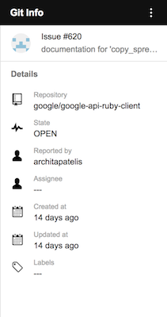

# Sample add-on: GitHub Reader

This is a sample add-on that demonstrates using external services to bring
rich information into Gmail, as well as contextual triggering based on
email content. It triggers in response to messages containing links
[GitHub](github) issues or pull requests and displays additional relevant
information.

Note: This is not an official Google product.

## Before you begin

If you're new to add-on development or Apps Script, try the [quickstart](quickstart)
before proceeding. 
 
These instructions assume [Node.js](node) is installed.

Using the add-on requires a [GitHub](github) account, as well as notification
emails for an issue or pull request from from a hosted repostiory.

## Downloading the sample

Download the sample app and navigate into the app directory:

1.  Clone the [Gmail add-ons samples][github-repo], to your local
    machine:

        git clone https://github.com/googlesamples/gmail-add-on-samples.git

    Alternatively, you can [download the sample][github-zip] as a zip file and
    extract it.

2.  Change to the sample directory:

        cd gmail-add-on-samples/github

3.  Initialize the project:

        npm install
        
4.  Bundle the dependencies:

        npm run build
        
## Deploy the add-on

Deploy the add-on by following these steps:

1.  Create a new [Apps Script](apps-script) project in your web browser. Apps Script places the project file in your Drive root folder so you can find it later.

2.  Choose Blank Project if presented with a welcome screen.

3.  For each file in the `src` and `dist` directories:

    1. Click **File > New > Script file** to create a new file.

    2. Copy the contents of the source file to the newly created file.
    
4.  Click **View > Show manifest file**.

5.  Copy the contents of `appsscript.json` into the same file in the editor.

6.  In the script editor, select **Publish > Deploy from manifest...**.

7.  In the **Deployments** dialog, click the Get ID link for the **Head Deployment**.

8.  Locate the head deployment the **Deployment ID**. Copy this ID and then click **Close**.

9.  In the Deployments dialog, click **Cancel**. Creating a new deployment is not necessary, as you are using the head deployment only.

## Configure GitHub credentials

Access the GitHub API requires registration. To register your own application:

1.  Open the script editor:

        gasp open

2.  Get the script id by clicking on **File > Project properties** and note the value of the **Script ID** field.

3.  Follow [GitHub's guide](github-oauth) to create an OAuth Application. Use the value `https://script.google.com/macros/d/{SCRIPT_ID}/usercallback` for the **Authorization callback URL**,
    replacing `{SCRIPT_ID}` with the script id located in the previous step.

4.  Create a script property with the credentials:

    a. Click on **File > Project properties > Script properties**.
	
	b. Click **Add row**.
	
	c. Enter the property name `githubCredentials`.
	
	d. Click on the blank area in the **Value** column.
	
	e. Enter the value below, subsituting the `{CLIENT_ID}` and `{CLIENT_SECRET}` with the values provided
	   by GitHub.
	
	    {"clientId": "{CLIENT_ID}", "clientSecret": "{CLIENT_SECRET}" } 

	f. Click **Save**.

## Install the add-on

One the add-on is deployed, install the add-on on your account using these steps:

1.  Open the [Gmail add-on settings](gmail-settings) tab.

2.  In the **Add-ons** tab, ensure that you have selected the **Enable developer
    add-ons for my account** checkbox.

3.  Paste your add-on's deployment ID into the **Install developer add-on** textbox
    and click **Install**.

4. In the **Install developer add-on** dialog that appears, click the checkbox to
   indicate that you trust this developer (yourself), then click **Install**.

The add-on appears in the **Developer add-ons** list at this point. The
**Enable debugging information** checkbox (which is checked by default) instructs
Gmail to create and display an error report card when script or runtime errors
occur during the execution of the add-on.

## Run the add-on

1.  Open [Gmail](gmail). If Gmail was open prior to enabling the add-on,
    you may need to refresh the tab.

2.  Open a message in Gmail.

3.  The add-on should place a contextual card on the right-side of the window,
    with a message asking for authorization. Click the **Authorize access** link
    to open a dialog where you can authorize the add-on.

4.  Select the account that should authorize the add-on.

5.  The next dialog may inform you that the app is not verified. In this case you
    can proceed by doing the following:

    a.  Click **Advanced**.

    b. At the bottom of the dialog, click **Go to Git Info (unsafe)**.

    c. In the new dialog, type "Continue" into the text field, then click **Next**.

6.  Read the notice in the next dialog carefully, then click **Allow**.

7.  Once authorized, the add-on should automatically refresh and start operating.

## Contributing

Please read our [guidelines for contributors][contributing].

## License

This sample is licensed under the [Apache 2 license][license].

<!-- References -->
[quickstart]:https://developers.google.com/gmail/add-ons/guides/quickstart
[node]:https://nodejs.org/en/
[apps-script]: https://script.google.com
[github]: https://github.com
[github-repo]: https://github.com/googlesamples/gmail-add-ons-samples
[github-zip]: https://github.com/googlesamples/gmail-add-ons-samples/archive/master.zip
[contributing]: https://github.com/googlesamples/gmail-add-ons-samples/blob/master/CONTRIBUTING
[license]: https://github.com/googlesamples/gmail-add-ons-samples/blob/master/LICENSE
[gmail-setting]: https://mail.google.com/mail/#settings/addons
[gmail]: https://mail.google.com/
[lodash]: https://lodash.com/
[moment]: http://momentjs.com/
[github-oauth]: https://developer.github.com/apps/building-integrations/setting-up-and-registering-oauth-apps/registering-oauth-apps/