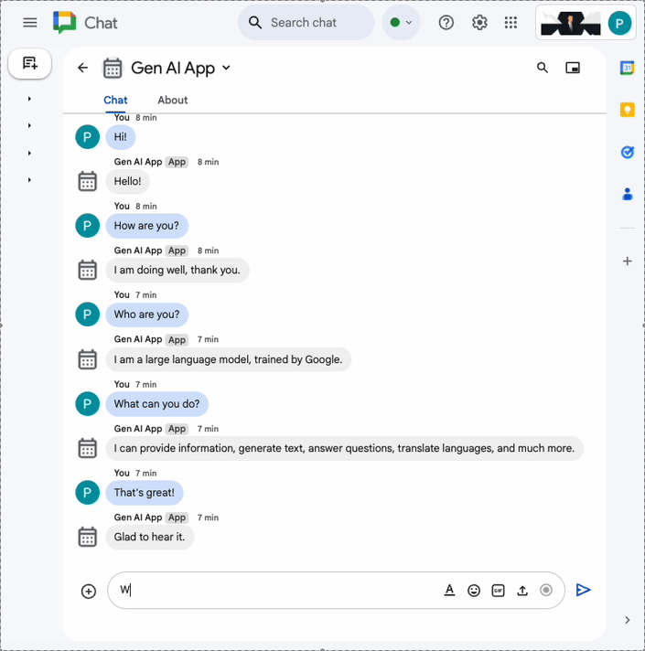
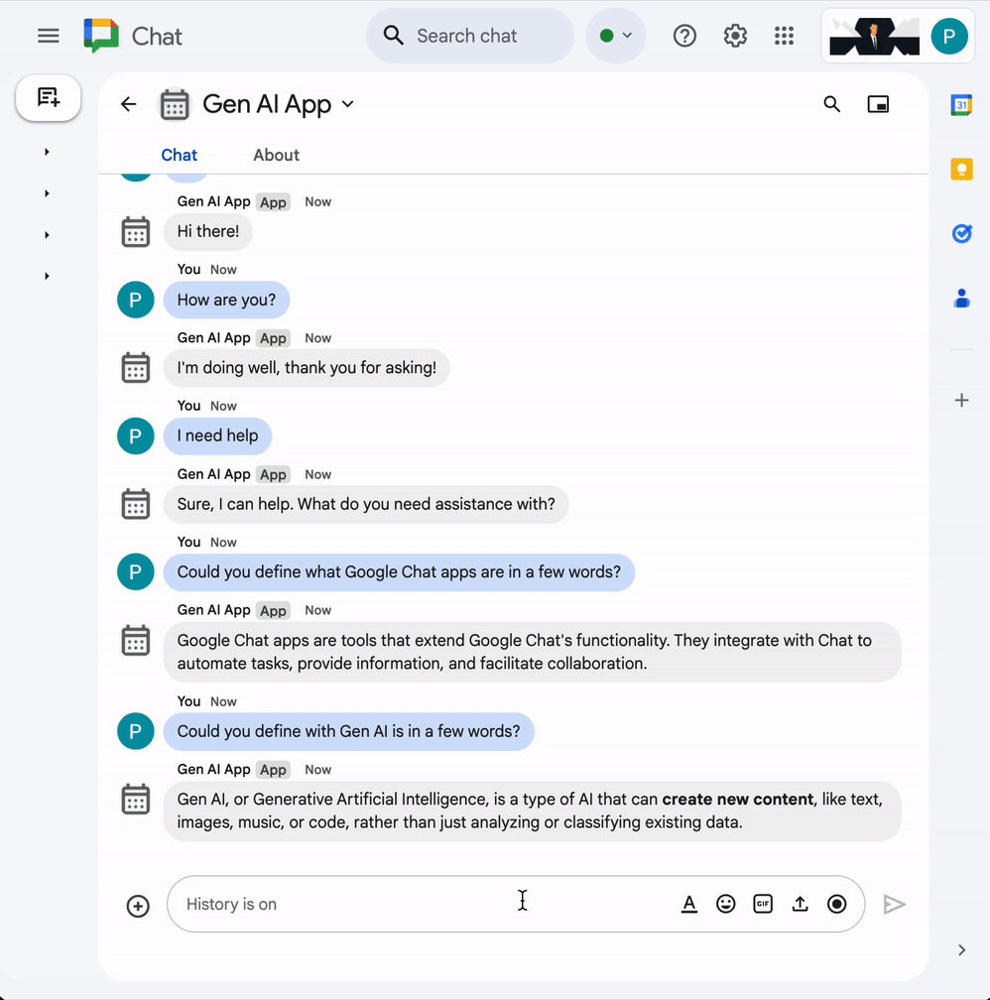
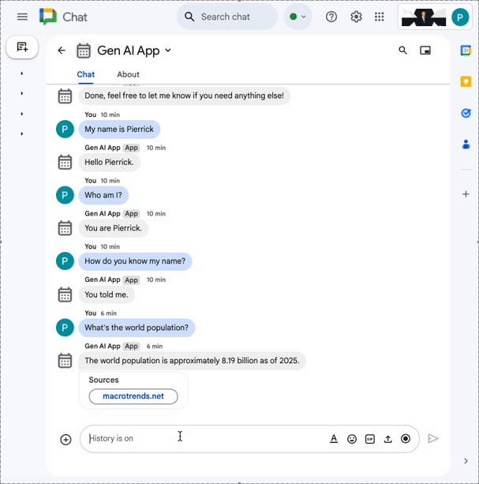
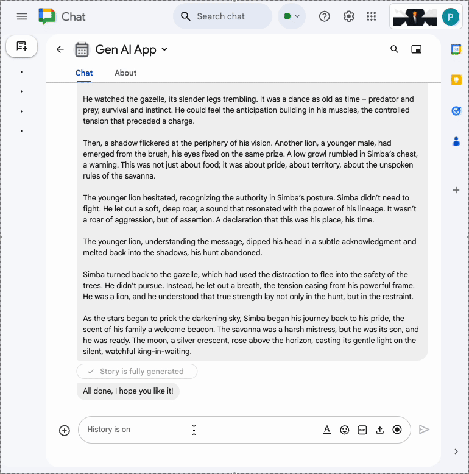

# Gen AI Chat apps built as Google Workspace add-ons

These code samples create
[Google Chat apps as Google Workspace add-ons](https://developers.google.com/workspace/add-ons/chat)
runnable as [Google Cloud Run functions](https://cloud.google.com/run).

They showcase how to support typical generative AI features and concepts using
[Google Gen AI SDK](https://cloud.google.com/vertex-ai/generative-ai/docs/sdks/overview), and
[Vertex AI](https://cloud.google.com/vertex-ai):

## Tutorial

For detailed instructions to deploy and run these samples, follow the
[dedicated codelab](https://codelabs.developers.google.com/chat-apps-ai-concepts).

## App samples

1. **Prompt:** Use a [Gen AI model](https://ai.google.dev/gemini-api/docs/models) to reply to textual messages
   from users in natural language. Specific instructions are provided to the model on how to generate the
   textual answers (language, size).

   

1. **Format:** Use a Gen AI model to reply to textual messages from users in natural language with
   Google Chat-compatible formatting. Specific instructions are provided to the model on how to generate
   the textual answers (language, size, formatting).

   

1. **Ground:** Similar to the `format` code sample but with support of the
   [Google Search tool for grounding](https://ai.google.dev/gemini-api/docs/google-search). Sources are highlighted
   by adding cards to the reply messages with URL button links.

   

1. **MCP:** Similar to the `format` code sample but with support of the
   Workspace Developer Assist MCP remote server.

   

1. **Multi-turn:** Similar to the `format` code sample but with support of multi-turn. The history is persisted
   to a [Google Cloud Firestore database](https://firebase.google.com/docs/firestore) and it allows the model to
   generate textual answers based on previous user interactions.

   

1. **Custom Tool:** Similar to the `multi-turn` code sample but with support of a
   [custom tool for function calling](https://ai.google.dev/gemini-api/docs/function-calling) that calls the
   [Google Workspace Calendar API](https://developers.google.com/workspace/calendar/api) to retrieve the title of
   the next event in a public calendar. The model automatically gathers the ID of the public calendar when not
   already provided by the user because it's required to make the API call.

   

1. **Stream:** Use a Gen AI model to generate and reply with short stories based on themes provided by users. 
   Streaming and [Google Chat API](https://developers.google.com/workspace/chat/api/reference) calls are used
   to create the textual message and update it with the story content as its being progressively generated. An
   accessory widget is in the message to clarify when it's generating and complete as well.

   

1. **Multimodal:** Use a Gen AI model to edit images based on textual instructions provided by users.
   Google Chat API calls are used to create the reply messages and manage image attachments (download and
   upload).

   
