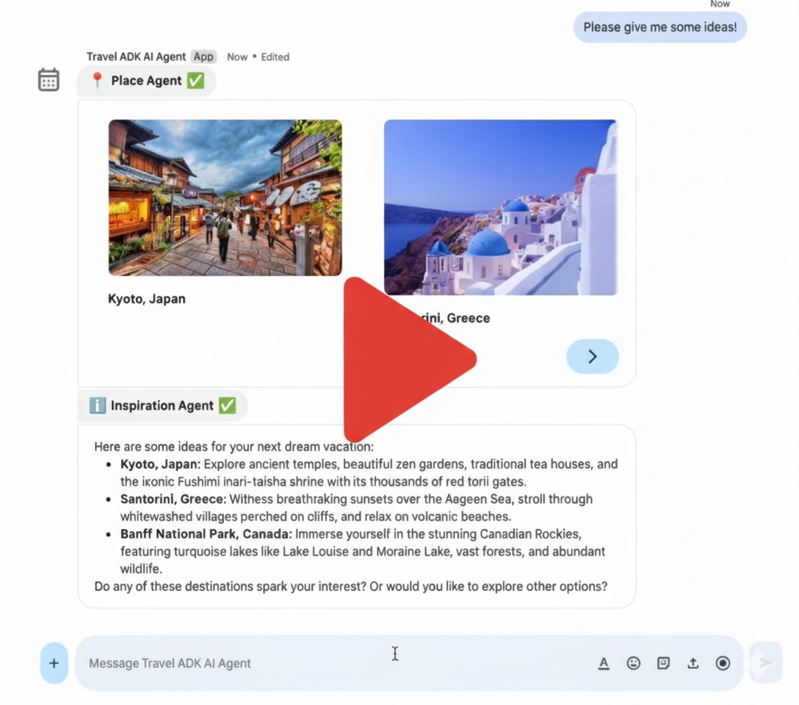

# Travel Concierge ADK AI multi-agent published as Google Workspace add-on

This project integrates the Travel Concierge—an advanced, multi-agent AI from the Agent Development Kit (ADK) samples—into Google Workspace applications: Chat, Gmail, Calendar, Drive, Docs, Sheets, and Slides.

## Tutorial

🚀 For detailed instructions to deploy and run this sample, follow the
[dedicated tutorial](https://developers.google.com/workspace/add-ons/samples/travel-concierge).

## Showcase

## Overview

While the ADK provides default interfaces for developers (chat and text), this project focuses on creating a Graphical User Interface (GUI) dedicated to end-users. It demonstrates how to publish the Travel Concierge as a single Google Workspace add-on, making it accessible directly within Google Workspace applications.

This solution serves as a practical guide and a reusable framework for developers who want to connect powerful, custom AI agents to Google Workspace, allowing users to leverage advanced AI capabilities seamlessly within their existing workflows.

## Agent

The [Travel Concierge ADK AI multi-agent being used](https://github.com/google/adk-samples/tree/main/python/agents/travel-concierge) is a conversational agent sample developed with the ADK. It's an advanced example, really close to a real-life AI agent. It uses tools like the Google Places API, Google Search Grounding, and a Model Context Protocol (MCP) server.

To expose this agent to end-users, a GUI with specific features is necessary as discussed [here](https://github.com/google/adk-samples/blob/main/python/agents/travel-concierge/README.md#gui). This sample shows how to build such a GUI by extending Google Workspace.

## Architecture

This solution relies on the following technologies: Google Chat API, People API, Gmail API, Vertex AI Agent Engine API, Python, and Google Cloud Functions.

## Customization

The core logic supports any ADK AI agent hosted in Vertex AI Agent Engine. Key customization points are:

* `main.py`: Defines the main UI layouts and user interaction logic (Google Workspace event handlers). Example: Add support for Calendar event or Drive document context.

* `vertex_ai.py`: Manages the streamed agent events, sessions, and error handling. Example: Enable multi-sessions for separate user conversations.

* `agent_handler.py`: Implements abstracted functions for orchestrating operations. Example: Synchronize message history across all host applications.

* `google_workspace.py`: Handles API interactions with other systems to gather context or take actions. Example: Add functions to retrieve details of a Calendar event.

* `travel_agent_ui_render.py`: Controls how agent responses are displayed to end-users. Example: Design a new card to show a person's profile and avatar.
